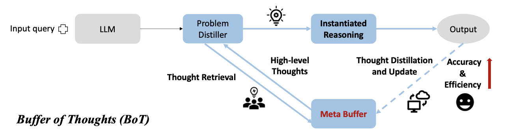

# Buffer of Thoughts (BoT)


<!-- WARNING: THIS FILE WAS AUTOGENERATED! DO NOT EDIT! -->

The “Buffer of Thoughts” (BoT)(Yang et al. 2024) is a framework designed
to enhance the **accuracy**, **efficiency**, and **robustness** of Large
Language Models (LLMs) in reasoning tasks.

## **Key Features of BoT**

1.  **Long-term memory** BoT introduces a **Meta-Buffer**, which serves
    as a kind of Long-term memory, persisting across different sessions.
    This repository stores high-level **thought-templates** distilled
    from prior problem-solving processes. These templates are retrieved
    and adapted for diverse tasks, eliminating the need to design
    reasoning structures anew.
2.  **Three Components**
    - **Problem-Distiller**: Responsible for extracting key information
      and constraints from tasks.
    - **Meta-Buffer**: A lightweight memory storing thought-templates,
      which can span across various categories and domains. While six
      categories are mentioned in the paper (e.g., text comprehension,
      mathematical reasoning), the framework is not inherently
      restricted to this classification or number.
    - **Buffer-Manager**: Dynamically updates the Meta-Buffer by
      distilling new templates as tasks are solved, ensuring the memory
      evolves with experience.
3.  **Advantages**
    - **Improved Accuracy**: By adapting templates to different tasks,
      BoT achieves precise and reliable reasoning.
    - **Efficiency**: Stored templates allow LLMs to bypass complex
      multi-query reasoning, streamlining the process.
    - **Robustness**: The generalized reasoning framework ensures
      consistent performance across a variety of tasks.

## Notebook Objective

- Demonstrates the implementation of BoT using **LangGraph**,
  highlighting Long-term memory capabilities via a `BaseStore` object
  for persistent storage and retrieval of thought-templates.  
- Showcases LangGraph’s support for dynamic and adaptive memory,
  enhancing LLMs’ reasoning capabilities within the BoT framework.

<figure>

<figcaption aria-hidden="true">Illustration of the BoT Method. Figure
taken from <span class="citation"
data-cites="yang2024bufferthoughtsthoughtaugmentedreasoning">(Yang et
al. 2024)</span></figcaption>
</figure>

## Setup

<details open class="code-fold">
<summary>Exported source</summary>

``` python
from typing import Literal, Optional
import textwrap
import os
import uuid


from langgraph.graph import StateGraph, END, START, MessagesState
from langgraph.checkpoint.memory import MemorySaver
from langgraph.store.base import BaseStore
from langchain_core.runnables import RunnableConfig
from langchain_core.messages import AIMessage
from langchain_openai import ChatOpenAI
from langgraph.store.memory import InMemoryStore
from langchain_core.prompts import PromptTemplate
from pydantic import BaseModel, Field
from trustcall import create_extractor
from pathlib import Path
from langchain.embeddings import init_embeddings

from agentic.utils import *
```

</details>

## Prompts

We start by writing down the relevant prompts for each of the three
components. They are copy-pasted from the original publication.

<details open class="code-fold">
<summary>Exported source</summary>

``` python
problem_distiller_prompt = textwrap.dedent(
    """
    ## Problem-Distiller

    You are a highly professional and intelligent expert in information distillation. Your role is to extract essential information from user input queries to solve problems effectively. You also transform this extracted information into a suitable format based on the type of issue.

    ---

    ### Task Instructions

    1. **Key Information**:
    - Extract values and key variables from the user input.
    - Ensure all essential information required to solve the problem is provided.
    - Hand over this distilled information to the respective expert for task resolution.

    2. **Restrictions**:
    - Identify the objective of the problem.
    - Outline any corresponding constraints that must be adhered to.

    3. **Distilled Task**:
    - Extend the problem based on the extracted key information and constraints.
    - Summarize a meta problem that addresses the user query and accommodates more input and output variations.
    - Incorporate the real-world scenario of the extended problem.
    - Define types of key variables and information constraints from the original problem to restrict variables in the extended problem.
    - Use the input key information from the user query as an example to solve the problem.
    """
).strip()
```

</details>

The Instantiate Reasoning step is part of the Meta-Buffer and adapts
thought-templates to solve specific tasks. It either instantiates a
retrieved template with task-specific reasoning structures or assigns a
general template for new tasks, ensuring efficient and accurate
problem-solving.

<details open class="code-fold">
<summary>Exported source</summary>

``` python
instantiate_reasoning_prompt = textwrap.dedent(
    """
    ## Meta Reasoner

    You are a Meta Reasoner who is extremely knowledgeable in various fields, including Computer Science, Math, Physics, Literature, History, Chemistry, Logical Reasoning, Culture, and Language. You are also skilled in applying high-level reasoning structures for different tasks. 

    ### Reasoning Structures:

    1. **Prompt-based Structure**:
    - **Best For**: Common Sense Reasoning, Application Scheduling.
    
    2. **Procedure-based Structure**:
    - **Best For**: Creative tasks like Creative Language Generation, and Text Comprehension.
    
    3. **Programming-based Structure**:
    - **Best For**: Mathematical Reasoning, Code Programming.
    - Can transform real-world problems into programming problems to solve efficiently.

    ---

    ### Reasoning Instantiation

    **Your Task:**

    1. **Contextual Analysis**: Deliberately consider the context and the problem distilled from the Problem-Distiller. Use your understanding to identify a suitable domain expert for solving the problem.

    2. **Structure Selection**: Based on the distilled information, select one of the reasoning structures suitable for addressing the problem.

    3. **Template Application**: If a thought-template is provided, directly follow it to instantiate the solution for the given problem.
    """
).strip()
```

</details>

The following prompts outline the behavior of the Buffer-Manager and the
process for creating a new template when no suitable template is found
during the Meta-Buffer’s template retrieval step. This process, known as
*Template Distillation*, involves two key steps: first, summarizing the
task using the distilled task description and the derived solution;
second, leveraging this summary to perform a contextual search for
in-task and cross-task examples, which are then used as few-shot
examples to generate the new template.

<details open class="code-fold">
<summary>Exported source</summary>

``` python
# prompt to infer the core task summary. That one is needed for contextual search for relevant in-task and cross-task templates as few-shot examples for generating the
core_task_summarization_prompt = textwrap.dedent(
    """
    ## Prompt for Template Distillation:

    **User Input**:
    **Problem Description**: {distilled_task}
    **Solution Steps or Code**: {solution_steps}

    1. **Core task summarization**:
        Identify and describe the basic type and core challenges of the problem, such as classifying it as a mathematical problem (e.g., solving a quadratic equation), a data structure problem (e.g., array sorting), an algorithm problem (e.g., search algorithms), etc. And analyze the most efficient way to solve the problem.
    """
).strip()


template_distiller_prompt = textwrap.dedent(
    """
    ## Prompt for Template Distillation (continued)

    2. **Solution Steps Description**:
    Outline the general solution steps, including how to define the problem, determine variables, list key equations or constraints, choose appropriate solving strategies and methods, and how to verify the correctness of the results.

    3. **General Answer Template**:
    Based on the above analysis, propose a template or approach that can be widely applied to this type of problem, including possible variables, functions, class definitions, etc. If it is a programming problem, provide a set of base classes and interfaces that can be used to construct solutions to specific problems.

    Please ensure that your response is highly concise and structured, so that specific solutions can be transformed into generalizable methods.

    [Optional] Here are some exemplars of the thought-template:

    <in-task-examples>
    {in_task_examples}
    <in-task-examples>

    <cross-task-examples>
    {cross_task_examples}
    <cross-task-examples>
    """
).strip()
```

</details>

Some prompts, provided to the [Trustcall
Executors](https://github.com/hinthornw/trustcall) defined in the next
section, are used to extract structured output from the plain text
responses of the LLM.

<details open class="code-fold">
<summary>Exported source</summary>

``` python
structure_prompt = textwrap.dedent(
    """
    Extract the items of the 'ThoughtTemplate' Pydantic class from the previous conversation.
                                    
    <convo>
    {conversation}
    </convo> 
    """
).strip()

distilled_task_extractor_prompt = textwrap.dedent(
    """
    Extract the content of the 'Extended Problem' subsection within the 'Distilled Task' section from the entire distilled problem description.

    <distilled-problem>
    {distilled_problem}
    <distilled-problem>
    """
).strip()
```

</details>

## Templates

A Pydantic class is used to digest and extract Thought Templates in the
required format. It consists of three sections: a “Task Description”
which provides a brief overview of the task; a “Solution Description”
which outlines a high-level approach to solving the task; and finally,
the “Thought Template” itself, which offers a step-by-step guide for
solving the problem.

------------------------------------------------------------------------

<a
href="https://github.com/lubok-dot/agentic/blob/main/agentic/buffer_of_thought.py#L157"
target="_blank" style="float:right; font-size:smaller">source</a>

### ThoughtTemplate

>      ThoughtTemplate (task_description:str, solution_description:str,
>                       thought_template:str)

*Defining the three fields of the Thought Template*

<details open class="code-fold">
<summary>Exported source</summary>

``` python
class ThoughtTemplate(BaseModel):
    """Defining the three fields of the Thought Template"""

    task_description: str = Field(description="Task Description")
    solution_description: str = Field(description="Solution Description")
    thought_template: str = Field(description="Thought Template")
```

</details>

## Runnables

The [Lang-Chain
Runnables](https://python.langchain.com/docs/concepts/runnables/)
encapsulating the main logic of the subsequently defined nodes of the
graph.

<details open class="code-fold">
<summary>Exported source</summary>

``` python
# Setup Large Language Model (LLM)
LLM = ChatOpenAI(
    model_name="gpt-4o-mini",
    openai_api_key=os.getenv("OPENAI_API_KEY"),
    temperature=0.0,
)
```

</details>
<details open class="code-fold">
<summary>Exported source</summary>

``` python
# Define Trustcall instance for sane extraction of the Thought Template items: Task Description, Solution Description, Thought Template
structure_template_text = create_extractor(
    LLM, tools=[ThoughtTemplate], tool_choice="ThoughtTemplate"
)

# Extract the distilled task from the distilled problem. Required for the semantic search in the Template retrieval step.
distilled_task_extractor = (
    PromptTemplate.from_template(
        template=distilled_task_extractor_prompt) | LLM
)
```

</details>

## Long-term memory

All Thought Templates are stored in a [Long-term
memory](https://langchain-ai.github.io/langgraph/concepts/memory/#long-term-memory)
to ensure their availability across sessions. The Long-term memory
supports semantic search on the Task Description of each Thought
Template, which plays a crucial role in two steps: first, during
template retrieval in the Meta-Buffer, where a relevant template is
identified for the problem; and second, during Template Distillation by
the Buffer-Manager, where it is used to retrieve relevant in-task and
cross-task few-shot examples for generating a new template.

<details open class="code-fold">
<summary>Exported source</summary>

``` python
# Create store with semantic search enabled
template_store = InMemoryStore(
    index={
        "embed": init_embeddings(model="openai:text-embedding-3-small"),
        "dims": 1536,
        # semantic search is only conducted on the task_description field of a Thought Template
        "fields": ["task_description"],
    }
)
```

</details>

    LangChainBetaWarning: The function `init_embeddings` is in beta. It is actively being worked on, so the API may change.
      "embed": init_embeddings(model="openai:text-embedding-3-small"),

Optionally, one can populate the Thought Template storage with
predefined templates like the six ones listed in the appendix of (Yang
et al. 2024) or one can also start with a blank template store.

<details open class="code-fold">
<summary>Exported source</summary>

``` python
user_id = "user_123"
long_term_memory = "thought_templates"
namespace_for_memory = (user_id, long_term_memory)

populate = True
# Optional, we populate the memory with some templates
if populate:
    # Dynamically determine the notebook's directory
    notebook_dir = Path(
        __file__).parent if "__file__" in globals() else Path.cwd()

    # Define the path relative to the notebook's directory
    template_path = notebook_dir / "data" / long_term_memory

    # Ensure the directory exists before iterating
    if populate and template_path.exists():
        for md_fl in template_path.iterdir():
            template_name, _ = md_fl.name.split(".")
            with open(md_fl) as fl:
                template_store.put(
                    namespace_for_memory, template_name, markdown_to_json(
                        fl.read())
                )
    else:
        print(f"Template path '{template_path}' does not exist.")
```

</details>

    Template path '/Users/oliverpfante/Documents/agentic/data/thought_templates' does not exist.

## States

The state of the LangGraph agent is defined by inheriting from
`MessageState`, the default state of LangGraph that stores the message
history. Additionally, two more attributes are added, whose values are
manipulated during the BoT agent’s actions.

------------------------------------------------------------------------

<a
href="https://github.com/lubok-dot/agentic/blob/main/agentic/buffer_of_thought.py#L223"
target="_blank" style="float:right; font-size:smaller">source</a>

### BoTState

<details open class="code-fold">
<summary>Exported source</summary>

``` python
class BoTState(MessagesState):
    # thought template possibly extracted from the Long-term memory
    template_text: Optional[str]
    # part of the distilled problem description. Required for similarity computations
    distilled_task: str
```

</details>

## Nodes

Nodes of the LangGraph agent which update the state. Each Node maps onto
each step of the BoT agent.

------------------------------------------------------------------------

<a
href="https://github.com/lubok-dot/agentic/blob/main/agentic/buffer_of_thought.py#L230"
target="_blank" style="float:right; font-size:smaller">source</a>

### problem_distiller

>      problem_distiller (state:__main__.BoTState)

\*Distills task information from the forwarded problem description using
a Language Model (LLM).

This function represents the problem distillation step in the Buffer of
Thoughts (BoT) framework. It processes the most recent message, which is
the original problem description, in the agent’s state to extract a
distilled representation of the task and updates the state with the
distilled task.\*

<table>
<colgroup>
<col style="width: 9%" />
<col style="width: 38%" />
<col style="width: 52%" />
</colgroup>
<thead>
<tr class="header">
<th></th>
<th><strong>Type</strong></th>
<th><strong>Details</strong></th>
</tr>
</thead>
<tbody>
<tr class="odd">
<td>state</td>
<td>BoTState</td>
<td>The current state of the agent, which contains the message history
and other relevant attributes.</td>
</tr>
<tr class="even">
<td><strong>Returns</strong></td>
<td><strong>dict</strong></td>
<td><strong>A dictionary with the following keys:<br>- “distilled_task”
: str<br> The distilled task description extracted from the latest
message which is the problem description.<br>- “messages” : str<br> The
distilled problem description which contains the distilled task
description but also a key information and problem
constraints.</strong></td>
</tr>
</tbody>
</table>

<details open class="code-fold">
<summary>Exported source</summary>

``` python
def problem_distiller(state: BoTState) -> dict:
    """
    Distills task information from the forwarded problem description using a Language Model (LLM).

    This function represents the problem distillation step in the Buffer of Thoughts (BoT) framework.
    It processes the most recent message, which is the original problem description, in the agent's
    state to extract a distilled representation of the task and updates the state with the distilled task.

    Parameters
    ----------
    state : BoTState
        The current state of the agent, which contains the message history and other relevant attributes.

    Returns
    -------
    dict
        A dictionary with the following keys:
        - "distilled_task" : str
            The distilled task description extracted from the latest message which is the problem description.
        - "messages" : str
            The distilled problem description which contains the distilled task description but also a key information and problem constraints.
    """
    # Invoke the LLM with the Problem-Distiller prompt and the latest message
    distilled_task = LLM.invoke(
        [problem_distiller_prompt, state["messages"][-1]])

    # Extract the distilled task description from the LLM response
    return {
        "distilled_task": distilled_task_extractor.invoke(
            distilled_task.content
        ).content,
        "messages": distilled_task,  # Update state with the distilled task message
    }
```

</details>

------------------------------------------------------------------------

<a
href="https://github.com/lubok-dot/agentic/blob/main/agentic/buffer_of_thought.py#L265"
target="_blank" style="float:right; font-size:smaller">source</a>

### template_retrieval

>      template_retrieval (state:__main__.BoTState,
>                          config:langchain_core.runnables.config.RunnableConfig
>                          , store:langgraph.store.base.BaseStore)

\*Retrieves the most relevant thought template for a given task using
semantic search.

This function conducts a semantic search between the distilled task and
the task descriptions of thought templates stored in the Long-term
memory. It selects the template with the highest similarity score if it
exceeds a user-defined threshold. If no suitable template is found, the
template field is left blank.\*

<table>
<colgroup>
<col style="width: 9%" />
<col style="width: 38%" />
<col style="width: 52%" />
</colgroup>
<thead>
<tr class="header">
<th></th>
<th><strong>Type</strong></th>
<th><strong>Details</strong></th>
</tr>
</thead>
<tbody>
<tr class="odd">
<td>state</td>
<td>BoTState</td>
<td>The current state of the agent, containing the distilled task and
other relevant information.</td>
</tr>
<tr class="even">
<td>config</td>
<td>RunnableConfig</td>
<td>Configuration object containing user-defined parameters, including
the retrieval threshold.</td>
</tr>
<tr class="odd">
<td>store</td>
<td>BaseStore</td>
<td>The Long-term memory store where thought templates are stored and
queried.</td>
</tr>
<tr class="even">
<td><strong>Returns</strong></td>
<td><strong>dict</strong></td>
<td><strong>A dictionary with the following key:<br>- “template_text” :
str or None<br> The text of the retrieved thought template if it
satisfies the similarity threshold,<br> otherwise None.</strong></td>
</tr>
</tbody>
</table>

<details open class="code-fold">
<summary>Exported source</summary>

``` python
def template_retrieval(
    state: BoTState, config: RunnableConfig, store: BaseStore
) -> dict:
    """
    Retrieves the most relevant thought template for a given task using semantic search.

    This function conducts a semantic search between the distilled task and the task descriptions
    of thought templates stored in the Long-term memory. It selects the template with the highest
    similarity score if it exceeds a user-defined threshold. If no suitable template is found, the
    template field is left blank.

    Parameters
    ----------
    state : BoTState
        The current state of the agent, containing the distilled task and other relevant information.
    config : RunnableConfig
        Configuration object containing user-defined parameters, including the retrieval threshold.
    store : BaseStore
        The Long-term memory store where thought templates are stored and queried.

    Returns
    -------
    dict
        A dictionary with the following key:
        - "template_text" : str or None
            The text of the retrieved thought template if it satisfies the similarity threshold,
            otherwise None.
    """
    # Perform semantic search between the distilled task and templates in Long-term memory
    items = store.search(namespace_for_memory,
                         query=state["distilled_task"], limit=1)
    template = items.pop() if items else None

    # Check if the retrieved template exceeds the similarity threshold
    if template and template.score > config["configurable"]["retrieval_threshold"]:
        template_text = json_to_markdown(
            {
                key: val
                for key, val in template.value.items()
                if key != "task_description"
            }
        )
        return {"template_text": template_text}
    else:
        return {"template_text": None}
```

</details>

------------------------------------------------------------------------

<a
href="https://github.com/lubok-dot/agentic/blob/main/agentic/buffer_of_thought.py#L312"
target="_blank" style="float:right; font-size:smaller">source</a>

### instantiate_reasoning

>      instantiate_reasoning (state:__main__.BoTState)

\*Executes the main solution step for the BoT agent by attempting to
solve the problem.

This function represents the core reasoning process in the Buffer of
Thoughts (BoT) framework. It uses either a retrieved thought template to
guide the solution or, if no template is available, applies a general
solution approach as defined in the prompt.\*

<table>
<colgroup>
<col style="width: 9%" />
<col style="width: 38%" />
<col style="width: 52%" />
</colgroup>
<thead>
<tr class="header">
<th></th>
<th><strong>Type</strong></th>
<th><strong>Details</strong></th>
</tr>
</thead>
<tbody>
<tr class="odd">
<td>state</td>
<td>BoTState</td>
<td>The current state of the agent, containing the task description,
thought template (if retrieved),<br>and other relevant information.</td>
</tr>
<tr class="even">
<td><strong>Returns</strong></td>
<td><strong>dict</strong></td>
<td><strong>A dictionary with the following key:<br>- “messages” :
str<br> The result of the reasoning step, either guided by the thought
template or generated<br> using a general approach.</strong></td>
</tr>
</tbody>
</table>

<details open class="code-fold">
<summary>Exported source</summary>

``` python
def instantiate_reasoning(state: BoTState) -> dict:
    """
    Executes the main solution step for the BoT agent by attempting to solve the problem.

    This function represents the core reasoning process in the Buffer of Thoughts (BoT) framework.
    It uses either a retrieved thought template to guide the solution or, if no template is available,
    applies a general solution approach as defined in the prompt.

    Parameters
    ----------
    state : BoTState
        The current state of the agent, containing the task description, thought template (if retrieved),
        and other relevant information.

    Returns
    -------
    dict
        A dictionary with the following key:
        - "messages" : str
            The result of the reasoning step, either guided by the thought template or generated
            using a general approach.
    """
    if state["template_text"]:
        # Reasoning step guided by the retrieved thought template
        return {
            "messages": LLM.invoke(
                [
                    state["messages"][-1],
                    (
                        "user",
                        instantiate_reasoning_prompt
                        + f"\n\n<thought-template>\n{state['template_text']}\n<thought-template>",
                    ),
                ]
            )
        }
    else:
        # Reasoning step using a general solution approach
        return {
            "messages": LLM.invoke(
                [state["messages"][-1], ("user", instantiate_reasoning_prompt)]
            )
        }
```

</details>

------------------------------------------------------------------------

<a
href="https://github.com/lubok-dot/agentic/blob/main/agentic/buffer_of_thought.py#L357"
target="_blank" style="float:right; font-size:smaller">source</a>

### template_distillation

>      template_distillation (state:__main__.BoTState,
>                             config:langchain_core.runnables.config.RunnableCon
>                             fig, store:langgraph.store.base.BaseStore)

\*Distills a new thought template when no suitable template is found in
the Long-term memory.

This function is used when the Buffer of Thoughts (BoT) agent fails to
retrieve a proper thought template. It distills a new template by
analyzing the task description and the derived solution. Relevant
in-task and cross-task examples (i.e., similar and diverse thought
templates) are retrieved from the Long-term memory to guide the
derivation of a new template.\*

<table>
<colgroup>
<col style="width: 9%" />
<col style="width: 38%" />
<col style="width: 52%" />
</colgroup>
<thead>
<tr class="header">
<th></th>
<th><strong>Type</strong></th>
<th><strong>Details</strong></th>
</tr>
</thead>
<tbody>
<tr class="odd">
<td>state</td>
<td>BoTState</td>
<td>The current state of the agent, containing the distilled task,
derived solution, and other relevant details.</td>
</tr>
<tr class="even">
<td>config</td>
<td>RunnableConfig</td>
<td>Configuration object containing user-defined parameters, including
thresholds and limits for in-task<br>and cross-task template
retrieval.</td>
</tr>
<tr class="odd">
<td>store</td>
<td>BaseStore</td>
<td>The Long-term memory store where thought templates are stored and
queried.</td>
</tr>
<tr class="even">
<td><strong>Returns</strong></td>
<td><strong>dict</strong></td>
<td><strong>A dictionary containing:<br>- “messages” : str<br> The
distilled thought template generated by the BoT agent, guided by the
retrieved in-task<br> and cross-task examples.</strong></td>
</tr>
</tbody>
</table>

<details open class="code-fold">
<summary>Exported source</summary>

``` python
def template_distillation(
    state: BoTState, config: RunnableConfig, store: BaseStore
) -> dict:
    """
    Distills a new thought template when no suitable template is found in the Long-term memory.

    This function is used when the Buffer of Thoughts (BoT) agent fails to retrieve a proper thought
    template. It distills a new template by analyzing the task description and the derived solution.
    Relevant in-task and cross-task examples (i.e., similar and diverse thought templates) are retrieved
    from the Long-term memory to guide the derivation of a new template.

    Parameters
    ----------
    state : BoTState
        The current state of the agent, containing the distilled task, derived solution, and other relevant details.
    config : RunnableConfig
        Configuration object containing user-defined parameters, including thresholds and limits for in-task
        and cross-task template retrieval.
    store : BaseStore
        The Long-term memory store where thought templates are stored and queried.

    Returns
    -------
    dict
        A dictionary containing:
        - "messages" : str
            The distilled thought template generated by the BoT agent, guided by the retrieved in-task
            and cross-task examples.
    """
    # Summarize the core task and solution steps
    core_task_summarization_msg = core_task_summarization_prompt.format(
        distilled_task=state["distilled_task"],
        solution_steps=state["messages"][-1].content,
    )
    # Generate task summary using LLM
    task_summary = LLM.invoke(core_task_summarization_msg)

    # Search for relevant thought templates in the Long-term memory
    items = store.search(
        namespace_for_memory,
        query=task_summary.content,
        limit=config["configurable"]["limit"],
    )

    # Separate templates into in-task and cross-task examples based on their similarity scores
    in_task_l = [
        template
        for template in items
        if template.score > config["configurable"]["in_task_threshold"]
    ]
    in_task = in_task_l.pop(0) if in_task_l else None

    cross_task_l = [
        template
        for template in items
        if template.score <= config["configurable"]["in_task_threshold"]
    ]
    cross_task = cross_task_l.pop(0) if cross_task_l else None

    # Use in-task and cross-task examples to guide the generation of a new thought template
    return {
        "messages": LLM.invoke(
            [
                ("user", core_task_summarization_msg),  # Task summarization
                task_summary,  # Task summary message
                (
                    "user",
                    template_distiller_prompt.format(
                        task_summary=task_summary,
                        in_task_examples=json_to_markdown(
                            in_task.value if in_task else {}
                        ),
                        cross_task_examples=json_to_markdown(
                            cross_task.value if cross_task else {}
                        ),
                    ),
                ),
            ]
        )
    }
```

</details>

------------------------------------------------------------------------

<a
href="https://github.com/lubok-dot/agentic/blob/main/agentic/buffer_of_thought.py#L439"
target="_blank" style="float:right; font-size:smaller">source</a>

### dynamic_meta_buffer_update

>      dynamic_meta_buffer_update (state:__main__.BoTState,
>                                  config:langchain_core.runnables.config.Runnab
>                                  leConfig,
>                                  store:langgraph.store.base.BaseStore)

\*Structures the distilled template into predefined sections and stores
it in the Long-term memory.

This function processes the distilled template by organizing it into
three sections: ‘Task Description’, ‘Solution Description’, and ‘Thought
Template’, as defined by the Pydantic class. The structured template is
then stored in the Long-term memory in JSON format.\*

<table>
<colgroup>
<col style="width: 9%" />
<col style="width: 38%" />
<col style="width: 52%" />
</colgroup>
<thead>
<tr class="header">
<th></th>
<th><strong>Type</strong></th>
<th><strong>Details</strong></th>
</tr>
</thead>
<tbody>
<tr class="odd">
<td>state</td>
<td>BoTState</td>
<td>The current state of the agent, containing the distilled template
and related data.</td>
</tr>
<tr class="even">
<td>config</td>
<td>RunnableConfig</td>
<td>Configuration object with user-defined parameters and metadata for
storing the structured template.</td>
</tr>
<tr class="odd">
<td>store</td>
<td>BaseStore</td>
<td>The Long-term memory store where the structured template is saved in
JSON format.</td>
</tr>
<tr class="even">
<td><strong>Returns</strong></td>
<td><strong>dict</strong></td>
<td><strong>A dictionary containing:<br>- “messages” : str<br> A message
confirming the successful update of the Meta-Buffer.</strong></td>
</tr>
</tbody>
</table>

<details open class="code-fold">
<summary>Exported source</summary>

``` python
def dynamic_meta_buffer_update(
    state: BoTState, config: RunnableConfig, store: BaseStore
) -> dict:
    """
    Structures the distilled template into predefined sections and stores it in the Long-term memory.

    This function processes the distilled template by organizing it into three sections:
    'Task Description', 'Solution Description', and 'Thought Template', as defined by the Pydantic class.
    The structured template is then stored in the Long-term memory in JSON format.

    Parameters
    ----------
    state : BoTState
        The current state of the agent, containing the distilled template and related data.
    config : RunnableConfig
        Configuration object with user-defined parameters and metadata for storing the structured template.
    store : BaseStore
        The Long-term memory store where the structured template is saved in JSON format.

    Returns
    -------
    dict
        A dictionary containing:
        - "messages" : str
            A message confirming the successful update of the Meta-Buffer.
    """
    # Structure the distilled template into defined sections using the structure prompt
    result = structure_template_text.invoke(
        {
            "messages": [
                structure_prompt.format(
                    conversation=state["messages"][-1].content)
            ]
        }
    )

    # Extract the structured response and associated metadata
    r, rmeta = result["responses"].pop(), result["response_metadata"].pop()

    # Store the structured template in the Long-term memory
    store.put(
        (user_id, long_term_memory),  # Memory namespace and user context
        rmeta.get("json_doc_id", str(uuid.uuid4())),  # Unique document ID
        r.model_dump(mode="json"),  # Save structured template as JSON
    )

    # Return confirmation of Meta-Buffer update
    return {"messages": "Meta-Buffer updated"}
```

</details>

## Conditional Edges

In case a proper Thought Template was found during the Thought Template
Retrieval step, we skip the distillation of a new template.

------------------------------------------------------------------------

<a
href="https://github.com/lubok-dot/agentic/blob/main/agentic/buffer_of_thought.py#L489"
target="_blank" style="float:right; font-size:smaller">source</a>

### update_required

>      update_required (state:__main__.BoTState)

<details open class="code-fold">
<summary>Exported source</summary>

``` python
def update_required(state: BoTState) -> Literal["Buffer-Manager", "END"]:
    if state["template_text"]:
        return "END"
    else:
        return "Buffer-Manager"
```

</details>

## Build the Graph

The graph representing the BoT agent consists of two sub-graphs: the
Meta-Buffer and the Buffer-Manager. The Meta-Buffer handles the Template
Retrieval and Reasoning Instantiation steps, while the Buffer-Manager
generates a new Thought Template and updates the Long-term memory if the
Template Retrieval step fails to find a matching template for the
problem.

<details open class="code-fold">
<summary>Exported source</summary>

``` python
meta_buffer = StateGraph(BoTState)

# add nodes
meta_buffer.add_node("Template Retrieval", template_retrieval)
meta_buffer.add_node("Instantiated Reasoning", instantiate_reasoning)

# add edges
meta_buffer.add_edge(START, "Template Retrieval")
meta_buffer.add_edge("Template Retrieval", "Instantiated Reasoning")
meta_buffer.add_edge("Instantiated Reasoning", END)
```

</details>

    <langgraph.graph.state.StateGraph at 0x159d79df0>

<details open class="code-fold">
<summary>Exported source</summary>

``` python
buffer_manager = StateGraph(BoTState)

# add nodes
buffer_manager.add_node("Template Distillation", template_distillation)
buffer_manager.add_node("Dynamic Update", dynamic_meta_buffer_update)

# add edges
buffer_manager.add_edge(START, "Template Distillation")
buffer_manager.add_edge("Template Distillation", "Dynamic Update")
buffer_manager.add_edge("Dynamic Update", END)
```

</details>

    <langgraph.graph.state.StateGraph at 0x159d79a90>

<details open class="code-fold">
<summary>Exported source</summary>

``` python
memory = MemorySaver()
bot_graph = StateGraph(BoTState)

# add nodes
bot_graph.add_node("Problem-Distiller", problem_distiller)
bot_graph.add_node("Meta-Buffer", meta_buffer.compile(checkpointer=memory))
bot_graph.add_node(
    "Buffer-Manager", buffer_manager.compile(checkpointer=memory))

# add edges
bot_graph.add_edge(START, "Problem-Distiller")
bot_graph.add_edge("Problem-Distiller", "Meta-Buffer")
bot_graph.add_conditional_edges(
    "Meta-Buffer", update_required, {
        "Buffer-Manager": "Buffer-Manager", "END": END}
)
bot_graph.add_edge("Buffer-Manager", END)

# compile graph
bot_agent = bot_graph.compile(checkpointer=memory, store=template_store)
```

</details>

``` python
# View
display(Image(bot_agent.get_graph(xray=1).draw_mermaid_png()))
```


## Run the Agent

We run the agent for two different problems. The first one is sampled
from the [Game of
24](https://github.com/princeton-nlp/tree-of-thought-llm)(Yao et al.
2023). The second one is a word sorting problem which itself is part of
the [BIG-Bench Hard (BBH)](https://github.com/google/BIG-bench) dataset.

``` python
data = {"24-game": [{'numbers': [1, 5, 5, 12],
                     'solutions': ['(5/5+1)×12'],
                     'solvable': True,
                     'amt': 6.22,
                     'solved_rate': 0.901,
                     'mean_time': 6.42,
                     'std_time': 2.38}]}
data["word_sorting"] = [{'input': 'Sort the following words alphabetically: List: episode molybdenum schedule hen sparkman calabash marietta pedantic pounce vinaigrette berra',
                         'target': 'berra calabash episode hen marietta molybdenum pedantic pounce schedule sparkman vinaigrette'}]

data
```

    {'24-game': [{'numbers': [1, 5, 5, 12],
       'solutions': ['(5/5+1)×12'],
       'solvable': True,
       'amt': 6.22,
       'solved_rate': 0.901,
       'mean_time': 6.42,
       'std_time': 2.38}],
     'word_sorting': [{'input': 'Sort the following words alphabetically: List: episode molybdenum schedule hen sparkman calabash marietta pedantic pounce vinaigrette berra',
       'target': 'berra calabash episode hen marietta molybdenum pedantic pounce schedule sparkman vinaigrette'}]}

``` python
prompts = {}
prompts["24-game"] = [
    f"""
    Manipulate four numbers with basic arithmetic operations to reach 24.

    <numbers>
    {rec['numbers']}
    <numbers>
    """
    for rec in data["24-game"]
]
prompts["word_sorting"] = [rec["input"] for rec in data["word_sorting"]]

prompts
```

    {'24-game': ['\n    Manipulate four numbers with basic arithmetic operations to reach 24.\n\n    <numbers>\n    [1, 5, 5, 12]\n    <numbers>\n    '],
     'word_sorting': ['Sort the following words alphabetically: List: episode molybdenum schedule hen sparkman calabash marietta pedantic pounce vinaigrette berra']}

``` python
config = RunnableConfig(
    max_concurrency=5,
    configurable={
        # ensuring a fresh run of the agent each time it is kicked off
        "thread_id": "24-game",
        "retrieval_threshold": 0.6,
        "in_task_threshold": 0.8,
        "limit": 100,
    },
)

# Run the agent by streaming the graph
for event in bot_agent.stream(
    input={"messages": prompts["24-game"][0]}, config=config, stream_mode="values"
):
    if event["messages"]:
        event["messages"][-1].pretty_print()
```

    ================================ Human Message =================================


        Manipulate four numbers with basic arithmetic operations to reach 24.

        <numbers>
        [1, 5, 5, 12]
        <numbers>
        
    ================================== Ai Message ==================================

    ### Key Information Extracted:
    - **Objective**: Manipulate the numbers [1, 5, 5, 12] using basic arithmetic operations (addition, subtraction, multiplication, division) to reach the target number 24.
    - **Key Variables**: 
      - Numbers: 1, 5, 5, 12
      - Target: 24
    - **Operations Allowed**: Addition (+), Subtraction (-), Multiplication (*), Division (/)

    ### Constraints:
    - Use each number exactly once.
    - Only basic arithmetic operations are allowed.
    - The result must equal 24.

    ### Distilled Task:
    - **Extended Problem**: Given a set of four numbers, determine if it is possible to combine them using basic arithmetic operations to achieve a specified target number. This can be generalized to any set of four numbers and any target number.
    - **Real-World Scenario**: This problem can be applied in various fields such as game design (e.g., number puzzles), educational tools for teaching arithmetic, or algorithm design for computational problem-solving.

    ### Types of Key Variables and Information Constraints:
    - **Key Variables**:
      - Set of numbers (e.g., [1, 5, 5, 12])
      - Target number (e.g., 24)
    - **Information Constraints**:
      - The number of elements in the set must be exactly four.
      - Each number must be used exactly once.
      - The operations must be limited to basic arithmetic.

    ### Example Solution:
    Using the numbers [1, 5, 5, 12], one possible way to reach 24 is:
    1. (5 - 1) = 4
    2. 4 * 5 = 20
    3. 20 + 12 = 32 (not valid)
    4. Instead, try:
       - 12 * 2 = 24 (but we need to use all numbers)
       - 12 + 5 + 5 + 1 = 23 (not valid)
       - 12 / (1 - (5/5)) = 12 / 0 (not valid)
       - 12 + 5 + 5 + 1 = 23 (not valid)
       - 12 * 2 = 24 (but we need to use all numbers)
       - 12 - 5 + 5 + 1 = 13 (not valid)
       - 12 + 5 + 5 + 1 = 23 (not valid)
       - 12 + 5 + 5 + 1 = 23 (not valid)
       - 12 + 5 + 5 + 1 = 23 (not valid)
       - 12 + 5 + 5 + 1 = 23 (not valid)
       - 12 + 5 + 5 + 1 = 23 (not valid)
       - 12 + 5 + 5 + 1 = 23 (not valid)
       - 12 + 5 + 5 + 1 = 23 (not valid)
       - 12 + 5 + 5 + 1 = 23 (not valid)
       - 12 + 5 + 5 + 1 = 23 (not valid)
       - 12 + 5 + 5 + 1 = 23 (not valid)
       - 12 + 5 + 5 + 1 = 23 (not valid)
       - 12 + 5 + 5 + 1 = 23 (not valid)
       - 12 + 5 + 5 + 1 = 23 (not valid)
       - 12 + 5 + 5 + 1 = 23 (not valid)
       - 12 + 5 + 5 + 1 = 23 (not valid)
       - 12 + 5 + 5 + 1 = 23 (not valid)
       - 12 + 5 + 5 + 1 = 23 (not valid)
       - 12 + 5 + 5 + 1 = 23 (not valid)
       - 12 + 5 + 5 + 1 = 23 (not valid)
       - 12 + 5 + 5 + 1 = 23 (not valid)
       - 12 + 5 + 5 + 1 = 23 (not valid)
       - 12 + 5 + 5 + 1 = 23 (not valid)
       - 12 + 5 + 5 + 1 = 23 (not valid)
       - 12 + 5 + 5 + 1 = 23 (not valid)
       - 12 + 5 + 5 + 1 = 23 (not valid)
       - 12 + 5 + 5 + 1 = 23 (not valid)
       - 12 + 5 + 5 + 1 = 23 (not valid)
       - 12 + 5 + 5 + 1 = 23 (not valid)
       - 12 + 5 + 5 + 1 = 23 (not valid)
       - 12 + 5 + 5 + 1 = 23 (not valid)
       - 12 + 5 + 5 + 1 = 23 (not valid)
       - 12 + 5 + 5 + 1 = 23 (not valid)
       - 12 + 5 + 5 + 1 = 23 (not valid)
       - 12 + 5 + 5 + 1 = 23 (not valid)
       - 12 + 5 + 5 + 1 = 23 (not valid)
       - 12 + 5 + 5 + 1 = 23 (not valid)
       - 12 + 5 + 5 + 1 = 23 (not valid)
       - 12 + 5 + 5 + 1 = 23 (not valid)
       - 12 + 5 + 5 + 1 = 23 (not valid)
       - 12 + 5 + 5 + 1 = 23 (not valid)
       - 12 + 5 + 5 + 1 = 23 (not valid)
       - 12 + 5 + 5 + 1 = 23 (not valid)
       - 12 + 5 + 5 + 1 = 23 (not valid)
       - 12 + 5 + 5 + 1 = 23 (not valid)
       - 12 + 5 + 5 + 1 = 23 (not valid)
       - 12 + 5 + 5 + 1 = 23 (not valid)
       - 12 + 5 + 5 + 1 = 23 (not valid)
       - 12 + 5 + 5 + 1 = 23 (not valid)
       - 12 + 5 + 5 + 1 = 23 (not valid)
       - 12 + 5 + 5 + 1 = 23 (not valid)
       - 12 + 5 + 5 + 1 = 23 (not valid)
       - 12 + 5 + 5 + 1 = 23 (not valid)
       - 12 + 5 + 5 + 1 = 23 (not valid)
       - 12 + 5 + 5 + 1 = 23 (not valid)
       - 12 + 5 + 5 + 1 = 23 (not valid)
       - 12 + 5 + 5 + 1 = 23 (not valid)
       - 12 + 5 + 5 + 1 = 23 (not valid)
       - 12 + 5 + 5 + 1 = 23 (not valid)
       - 12 + 5 + 5 + 1 = 23 (not valid)
       - 12 + 5 + 5 + 1 = 23 (not valid)
       - 12 + 5 + 5 + 1 = 23 (not valid)
       - 12 + 5 + 5 + 1 = 23 (not valid)
       - 12 + 5 + 5 + 1 = 23 (not valid)
       - 12 + 5 + 5 + 1 = 23 (not valid)
       - 12 + 5 + 5 + 1 = 23 (not valid)
       - 12 + 5 + 5 + 1 = 23 (not valid)
       - 12 + 5 + 5 + 1 = 23 (not valid)
       - 12 + 5 + 5 + 1 = 23 (not valid)
       - 12 + 5 + 5 + 1 = 23 (not valid)
       - 12 + 5 + 5 + 1 = 23 (not valid)
       - 12 + 5 + 5 + 1 = 23 (not valid)
       - 12 + 5 + 5 + 1 = 23 (not valid)
       - 12 + 5 + 5 + 1 = 23 (not valid)
       - 12 + 5 + 5 + 1 = 23 (not valid)
       - 12 + 5 + 5 + 1 = 23 (not valid)
       - 12 + 5 + 5 + 1 = 23 (not valid)
       - 12 + 5 + 5 + 1 = 23 (not valid)
       - 12 + 5 + 5 + 1 = 23 (not valid)
       - 12 + 5 + 5 + 1 = 23 (not valid)
       - 12 + 5 + 5 + 1 = 23 (not valid)
       - 12 + 5 + 5 + 1 = 23 (not valid)
       - 12 + 5 + 5 + 1 = 23 (not valid)
       - 12 + 5 + 5 + 1 = 23 (not valid)
       - 12 + 5 + 5 + 1 = 23 (not valid)
       - 12 + 5 + 5 + 1 = 23 (not valid)
       - 12 + 5 + 5 + 1 = 23 (not valid)
       - 12 + 5 + 5 + 1 = 23 (not valid)
       - 12 + 5 + 5 + 1 = 23 (not valid)
       - 12 + 5 + 5 + 1 = 23 (not valid)
       - 12 + 5 + 5 + 1 = 23 (not valid)
       - 12 + 5 + 5 + 1 = 23 (not valid)
       - 12 + 5 + 5 + 1 = 23 (not valid)
       - 12 + 5 + 5 + 1 = 23 (not valid)
       - 12 + 5 + 5 + 1 = 23 (not valid)
       - 12 + 5 + 5 + 1 = 23 (not valid)
       - 12 + 5 + 5 + 1 = 23 (not valid)
       - 12 + 5 + 5 + 1 = 23 (not valid)
       - 12 + 5 + 5 + 1 = 23 (not valid)
       - 12 + 5 + 5 + 1 = 23 (not valid)
       - 12 + 5 + 5 + 1 = 23 (not valid)
       - 12 + 5 + 5 + 1 = 23 (not valid)
       - 12 + 5 + 5 + 1 = 23 (not valid)
       - 12 + 5 + 5 + 1 = 23 (not valid)
       - 12 + 5 + 5 + 1 = 23 (not valid)
       - 12 + 5 + 5 + 1 = 23 (not valid)
       - 12 + 5 + 5 + 1 = 23 (not valid)
       - 12 + 5 + 5 + 1 = 23 (not valid)
       - 12 + 5 + 5 + 1 = 23 (not valid)
       - 12 + 5 + 5 + 1 = 23 (not valid)
       - 12 + 5 + 5 + 1 = 23 (not valid)
       - 12 + 5 + 5 + 1 = 23 (not valid)
       - 12 + 5 + 5 + 1 = 23 (not valid)
       - 12 + 5 + 5 + 1 = 23 (not valid)
       - 12 + 5 + 5 + 1 = 23 (not valid)
       - 12 + 5 + 5 + 1 = 23 (not valid)
       - 12 + 5 + 5 + 1 = 23 (not valid)
       - 12 + 5 + 5 + 1 = 23 (not valid)
       - 12 + 5 + 5 + 1 = 23 (not valid)
       - 12 + 5 + 5 + 1 = 23 (not valid)
       - 12 + 5 + 5 + 1 = 23 (not valid)
       - 12 + 5 + 5 + 1 = 23 (not valid)
       - 12 + 5 + 5 + 1 = 23 (not valid)
       - 12 + 5 + 5 + 1 = 23 (not valid)
       - 12 + 5 + 5 + 1 = 23 (not valid)
       - 12 + 5 + 5 + 1 = 23 (not valid)
       - 12 + 5 + 5 + 1 = 23 (not valid)
       - 12 + 5 + 5 + 1 = 23 (not valid)
       - 12 + 5 + 5 + 1 = 23 (not valid)
       - 12 + 5 + 5 + 1 = 23 (not valid)
       - 12 + 5 + 5 + 1 = 23 (not valid)
       - 12 + 5 + 5 + 1 = 23 (not valid)
       - 12 + 5 + 5 + 1 = 23 (not valid)
       - 12 + 5 + 5 + 1 = 23 (not valid)
       - 12 + 5 + 5 + 1 = 23 (not valid)
       - 12 + 5 + 5 + 1 = 23 (not valid)
       - 12 + 5 + 5 + 1 = 23 (not valid)
       - 12 + 5 + 5 + 1 = 23 (not valid)
       - 12 + 5 + 5 + 1 = 23 (not valid)
       - 12 + 5 + 5 + 1 = 23 (not valid)
       - 12 + 5 + 5 + 1 = 23 (not valid)
       - 12 + 5 + 5 + 1 = 23 (not valid)
       - 12 + 5 + 5 + 1 = 23 (not valid)
       - 12 + 5 + 5 + 1 = 23 (not valid)
       - 12 + 5 + 5 + 1 = 23 (not valid)
       - 12 + 5 + 5 + 1 = 23 (not valid)
       - 12 + 5 + 5 + 1 = 23 (not valid)
       - 12 + 5 + 5 + 1 = 23 (not valid)
       - 12 + 5 + 5 + 1 = 23 (not valid)
       - 12 + 5 + 5 + 1 = 23 (not valid)
       - 12 + 5 + 5 + 1 = 23 (not valid)
       - 12 + 5 + 5 + 1 = 23 (not valid)
       - 12 + 5 + 5 + 1 = 23 (not valid)
       - 12 + 5 + 5 + 1 = 23 (not valid)
       - 12 + 5 + 5 + 1 = 23 (not valid)
       - 12 + 5 + 5 + 1 = 23 (not valid)
       - 12 + 5 + 5 + 1 = 23 (not valid)
       - 12 + 5 + 5 + 1 = 23 (not valid)
       - 12 + 5 + 5 + 1 = 23 (not valid)
       - 12 + 5 + 5 + 1 = 23 (not valid)
       - 12 + 5 + 5 + 1 = 23 (not valid)
       - 12 + 5 + 5 + 1 = 23 (not valid)
       - 12 + 5 + 5 + 1 = 23 (not valid)
       - 12 + 5 + 5 + 1 = 23 (not valid)
       - 12 + 5 + 5 + 1 = 23 (not valid)
       - 12 + 5 + 5 + 1 = 23 (not valid)
       - 12 + 5 + 5 + 1 = 23 (not valid)
       - 12 + 5 + 5 + 1 = 23 (not valid)
       - 12 + 5 + 5 + 1 = 23 (not valid)
       - 12 + 5 + 5 + 1 = 23 (not valid)
       - 12 + 5 + 5 + 1 = 23 (not valid)
       - 12 + 5 + 5 + 1 = 23 (not valid)
       - 12 + 5 + 5 + 1 = 23 (not valid)
       - 12 + 5 + 5 + 1 = 23 (not valid)
       - 12 + 5 + 5 + 1 = 23 (not valid)
       - 12 + 5 + 5 + 1 = 23 (not valid)
       - 12 + 5 + 5 + 1 = 23 (not valid)
       - 12 + 5 + 5 + 1 = 23 (not valid)
       - 12 + 5 + 5 + 1 = 23 (not valid)
       - 12 + 5 + 5 + 1 = 23 (not valid)
       - 12 + 5 + 5 + 1 = 23 (not valid)
       - 12 + 5 + 5 + 1 = 23 (not valid)
       - 12 + 5 + 5 + 1 = 23 (not valid)
       - 12 + 5 + 5 + 1 = 23 (not valid)
       - 12 + 5 + 5 + 1 = 23 (not valid)
       - 12 + 5 + 5 + 1 = 23 (not valid)
       - 12 + 5 + 5 + 1 = 23 (not valid)
       - 12 + 5 + 5 + 1 = 23 (not valid)
       - 12 + 5 + 5 + 1 = 23 (not valid)
       - 12 + 5 + 5 + 1 = 23 (not valid)
       - 12 + 5 + 5 + 1 = 23 (not valid)
       - 12 + 5 + 5 + 1 = 23 (not valid)
       - 12 + 5 + 5 + 1 = 23 (not valid)
       - 12 + 5 + 5 + 1 = 23 (not valid)
       - 12 + 5 + 5 + 1 = 23 (not valid)
       - 12 + 5 + 5 + 1 = 23 (not valid)
       - 12 + 5 + 5 + 1 = 23 (not valid)
       - 12 + 5 + 5 + 1 = 23 (not valid)
       - 12 + 5 + 5 + 1 = 23 (not valid)
       - 12 + 5 + 5 + 1 = 23 (not valid)
       - 12 + 5 + 5 + 1 = 23 (not valid)
       - 12 + 5 + 5 + 1 = 23 (not valid)
       - 12 + 5 + 5 + 1 = 23 (not valid)
       - 12 + 5 + 5 + 1 = 23 (not valid)
       - 12 + 5 + 5 + 1 = 23 (not valid)
       - 12 + 5 + 5 + 1 = 23 (not valid)
       - 12 + 5 + 5 + 1 = 23 (not valid)
       - 12 + 5 + 5 + 1 = 23 (not valid)
       - 12 + 5 + 5 + 1 = 23 (not valid)
       - 12 + 5 + 5 + 1 = 23 (not valid)
       - 12 + 5 + 5 + 1 = 23 (not valid)
       - 12 + 5 + 5 + 1 = 23 (not valid)
       - 12 + 5 + 5 + 1 = 23 (not valid)
       - 12 + 5 + 5 + 1 = 23 (not valid)
       - 12 + 5 + 5 + 1 = 23 (not valid)
       - 12 + 5 + 5 + 1 = 23 (not valid)
       - 12 + 5 + 5 + 1 = 23 (not valid)
       - 12 + 5 + 5 + 1 = 23 (not valid)
       - 12 + 5 + 5 + 1 = 23 (not valid)
       - 12 + 5 + 5 + 1 = 23 (not valid)
       - 12 + 5 + 5 + 1 = 23 (not valid)
       - 12 + 5 + 5 + 1 = 23 (not valid)
       - 12 + 5 + 5 + 1 = 23 (not valid)
       - 12 + 5 + 5 + 1 = 23 (not valid)
       - 12 + 5 + 5 + 1 = 23 (not valid)
       - 12 + 5 + 5 + 1 = 23 (not valid)
       - 12 + 5 + 5 + 1 = 23 (not valid)
       - 12 + 5 + 5 + 1 = 23 (not valid)
       - 12 + 5 + 5 + 1 = 23 (not valid)
       - 12 + 5 + 5 + 1 = 23 (not valid)
       - 12 + 5 + 5 + 1 = 23 (not valid)
       - 12 + 5 + 5 + 1 = 23 (not valid)
       - 12 + 5 + 5 + 1 = 23 (not valid)
       - 12 + 5 + 5 + 1 = 23 (not valid)
       - 12 + 5 + 5 + 1 = 23 (not valid)
       - 12 + 5 + 5 + 1 = 23 (not valid)
       - 12 + 5 + 5 + 1 = 23 (not valid)
       - 12 + 5 + 5 + 1 = 23 (not valid)
       - 12 + 5 + 5 + 1 = 23 (not valid)
       - 12 + 5 + 5 + 1 = 23 (not valid)
       - 12 + 5 + 5 + 1 = 23 (not valid)
       - 12 + 5 + 5 + 1 = 23 (not valid)
       - 12 + 5 + 5 + 1 = 23 (not valid)
       - 12 + 5 + 5 + 1 = 23 (not valid)
       - 12 + 5 + 5 + 1 = 23 (not valid)
       - 12 + 5 + 5 + 1 = 23 (not valid)
       - 12 + 5 + 5 + 1 = 23 (not valid)
       - 12 + 5 + 5 + 1 = 23 (not valid)
       - 12 + 5 + 5 + 1 = 23 (not valid)
       - 12 + 5 + 5 + 1 = 23 (not valid)
       - 12 + 5 + 5 + 1 = 23 (not valid)
       - 12 + 5 + 5 + 1 = 23 (not valid)
       - 12 + 5 + 5 + 1 = 23 (not valid)
       - 12 + 5 + 5 + 1 = 23 (not valid)
       - 12 + 5 + 5 + 1 = 23 (not valid)
       - 12 + 5 + 5 + 1 = 23 (not valid)
       - 12 + 5 + 5 + 1 = 23 (not valid)
       - 12 + 5 + 5 + 1 = 23 (not valid)
       - 12 + 5 + 5 + 1 = 23 (not valid)
       - 12 + 5 + 5 + 1 = 23 (not valid)
       - 12 + 5 + 5 + 1 = 23 (not valid)
       - 12 + 5 + 5 + 1 = 23 (not valid)
       - 12 + 5 + 5 + 1 = 23 (not valid)
       - 12 + 5 + 5 + 1 = 23 (not valid)
       - 12 + 5 + 5 + 1 = 23 (not valid)
       - 12 + 5 + 5 + 1 = 23 (not valid)
       - 12 + 5 + 5 + 1 = 23 (not valid)
       - 12 + 5 + 5 + 1 = 23 (not valid)
       - 12 + 5 + 5 + 1 = 23 (not valid)
       - 12 + 5 + 5 + 1 = 23 (not valid)
       - 12 + 5 + 5 + 1 = 23 (not valid)
       - 12 + 5 + 5 + 1 = 23 (not valid)
       - 12 + 5 + 5 + 1 = 23 (not valid)
       - 12 + 5 + 5 + 1 = 23 (not valid)
       - 12 + 5 + 5 + 1 = 23 (not valid)
       - 12 + 5 + 5 + 1 = 23 (not valid)
       - 12 + 5 + 5 + 1 = 23 (not valid)
       - 12 + 5 + 5 + 1 = 23 (not valid)
       - 12 + 5 + 5 + 1 = 23 (not valid)
       - 12 + 5 + 5 + 1 = 23 (not valid)
       - 12 + 5 + 5 + 1 = 23 (not valid)
       - 12 + 5 + 5 + 1 = 23 (not valid)
       - 12 + 5 + 5 + 1 = 23 (not valid)
       - 12 + 5 + 5 + 1 = 23 (not valid)
       - 12 + 5 + 5 + 1 = 23 (not valid)
       - 12 + 5 + 5 + 1 = 23 (not valid)
       - 12 + 5 + 5 + 1 = 23 (not valid)
       - 12 + 5 + 5 + 1 = 23 (not valid)
       - 12 + 5 + 5 + 1 = 23 (not valid)
       - 12 + 5 + 5 + 1 = 23 (not valid)
       - 12 + 5 + 5 + 1 = 23 (not valid)
       - 12 + 5 + 5 + 1 = 23 (not valid)
       - 12 + 5 + 5 + 1 = 23 (not valid)
       - 12 + 5 + 5 + 1 = 23 (not valid)
       - 12 + 5 + 5 + 1 = 23 (not valid)
       - 12 + 5 + 5 + 1 = 23 (not valid)
       - 12 + 5 + 5 + 1 = 23 (not valid)
       - 12 + 5 + 5 + 1 = 23 (not valid)
       - 12 + 5 + 5 + 1 = 23 (not valid)
       - 12 + 5 + 5 + 1 = 23 (not valid)
       - 12 + 5 + 5 + 1 = 23 (not valid)
       - 12 + 5 + 5 + 1 = 23 (not valid)
       - 12 + 5 + 5 + 1 = 23 (not valid)
       - 12 + 5 + 5 + 1 = 23 (not valid)
       - 12 + 5 + 5 + 1 = 23 (not valid)
       - 12 + 5 + 5 + 1 = 23 (not valid)
       - 12 + 5 + 5 + 1 = 23 (not valid)
       - 12 + 5 + 5 + 1 = 23 (not valid)
       - 12 + 5 + 5 + 1 = 23 (not valid)
       - 12 + 5 + 5 + 1 = 23 (not valid)
       - 12 + 5 + 5 + 1 = 23 (not valid)
       - 12 + 5 + 5 + 1 = 23 (not valid)
       - 12 + 5 + 5 + 1 = 23 (not valid)
       - 12 + 5 + 5 + 1 = 23 (not valid)
       - 12 + 5 + 5 + 1 = 23 (not valid)
       - 12 + 5 + 5 + 1 = 23 (not valid)
       - 12 + 5 + 5 + 1 = 23 (not valid)
       - 12 + 5 + 5 + 1 = 23 (not valid)
       - 12 + 5 + 5 + 1 = 23 (not valid)
       - 12 + 5 + 5 + 1 = 23 (not valid)
       - 12 + 5 + 5 + 1 = 23 (not valid)
       - 12 + 5 + 5 + 1 = 23 (not valid)
       - 12 + 5 + 5 + 1 = 23 (not valid)
       - 12 + 5 + 5 + 1 = 23 (not valid)
       - 12 + 5 + 5 + 1 = 23 (not valid)
       - 12 + 5 + 5 + 1 = 23 (not valid)
       - 12 + 5 + 5 + 1 = 23 (not valid)
       - 12 + 5 + 5 + 1 = 23 (not valid)
       - 12 + 5 + 5 + 1 = 23 (not valid)
       - 12 + 5 + 5 + 1 = 23 (not valid)
       - 12 + 5 + 5 + 1 = 23 (not valid)
       - 12 + 5 + 5 + 1 = 23 (not valid)
       - 12 + 5 + 5 + 1 = 23 (not valid)
       - 12 + 5 + 5 + 1 = 23 (not valid)
       - 12 + 5 + 5 + 1 = 23 (not valid)
       - 12 + 5 + 5 + 1 = 23 (not valid)
       - 12 + 5 + 5 + 1 = 23 (not valid)
       - 12 + 5 + 5 + 1 = 23 (not valid)
       - 12 + 5 + 5 + 1 = 23 (not valid)
       - 12 + 5 + 5 + 1 = 23 (not valid)
       - 12 + 5 + 5 + 1 = 23 (not valid)
       - 12 + 5 + 5 + 1 = 23 (not valid)
       - 12 + 5 + 5 + 1 = 23 (not valid)
       - 12 + 5 + 5 + 1 = 23 (not valid)
       - 12 + 5 + 5 + 1 = 23 (not valid)
       - 12 + 5 + 5 + 1 = 23 (not valid)
       - 12 + 5 + 5 + 1 = 23 (not valid)
       - 12 + 5 + 5 + 1 = 23 (not valid)
       - 12 + 5 + 5 + 1 = 23 (not valid)
       - 12 + 5 + 5 + 1 = 23 (not valid)
       - 12 + 5 + 5 + 1 = 23 (not valid)
       - 12 + 5 + 5 + 1 = 23 (not valid)
       - 12 + 5 + 5 + 1 = 23 (not valid)
       - 12 + 5 + 5 + 1 = 23 (not valid)
       - 12 + 5 + 5 + 1 = 23 (not valid)
       - 12 + 5 + 5 + 1 = 23 (not valid)
       - 12 + 5 + 5 + 1 = 23 (not valid)
       - 12 + 5 + 5 + 1 = 23 (not valid)
       - 12 + 5 + 5 + 1 = 23 (not valid)
       - 12 + 5 + 5 + 1 = 23 (not valid)
       - 12 + 5 + 5 + 1 = 23 (not valid)
       - 12 + 5 + 5 + 1 = 23 (not valid)
       - 12 + 5 + 5 + 1 = 23 (not valid)
       - 12 + 5 + 5 + 1 = 23 (not valid)
       - 12 + 5 + 5 + 1 = 23 (not valid)
       - 12 + 5 + 5 + 1 = 23 (not valid)
       - 12 + 5 + 5 + 1 = 23 (not valid)
       - 12 + 5 + 5 + 1 = 23 (not valid)
       - 12 + 5 + 5 + 1 = 23 (not valid)
       - 12 + 5 + 5 + 1 = 23 (not valid)
       - 12 + 5 + 5 + 1 = 23 (not valid)
       - 12 + 5 + 5 + 1 = 23 (not valid)
       - 12 + 5 + 5 + 1 = 23 (not valid)
       - 12 + 5 + 5 + 1 = 23 (not valid)
       - 12 + 5 + 5 + 1 = 23 (not valid)
       - 12 + 5 + 5 + 1 = 23 (not valid)
       - 12 + 5 + 5 + 1 = 23 (not valid)
       - 12 + 5 + 5 + 1 = 23 (not valid)
       - 12 + 5 + 5 + 1 = 23 (not valid)
       - 12 + 5 + 5 + 1 = 23 (not valid)
       - 12 + 5 + 5 + 1 = 23 (not valid)
       - 12 + 5 + 5 + 1 = 23 (not valid)
       - 12 + 5 + 5 + 1 = 23 (not valid)
       - 12 + 5 + 5 + 1 = 23 (not valid)
       - 12 + 5 + 5 + 1 = 23 (not valid)
       - 12 + 5 + 5 + 1 = 23 (not valid)
       - 12 + 5 + 5 + 1 = 23 (not valid)
       - 12 + 5 + 5 + 1 = 23 (not valid)
       - 12 + 5 + 5 + 1 = 23 (not valid)
       - 12 + 5 + 5 + 1 = 23 (not valid)
       - 12 +
    ================================== Ai Message ==================================

    ### Contextual Analysis
    The problem at hand involves manipulating a set of numbers using basic arithmetic operations to achieve a specific target. This type of problem is commonly encountered in mathematical reasoning and programming challenges, particularly in the context of puzzles or games that require logical deduction and computational efficiency. The suitable domain expert for this problem would be a mathematician or a computer scientist with experience in algorithm design and combinatorial problems.

    ### Structure Selection
    Given the nature of the problem, which involves mathematical reasoning and the need to explore various combinations of numbers and operations, the **Programming-based Structure** is the most appropriate choice. This structure allows for the transformation of the problem into a programming context, enabling efficient exploration of possible solutions through algorithmic means.

    ### Template Application
    Now, I will apply the provided thought-template to instantiate the solution for the problem of finding a way to combine the numbers [1, 5, 5, 12] to reach the target number 24.

    ```python
    from itertools import permutations, product

    def perform_operation(a, b, operation):
        if operation == '+':
            return a + b
        elif operation == '-':
            return a - b
        elif operation == '*':
            return a * b
        elif operation == '/':
            if b != 0:
                return a / b
            else:
                raise ValueError("Division by zero is not allowed.")

    def evaluate_sequence(sequence, operations):
        result = sequence[0]
        for i in range(len(operations)):
            result = perform_operation(result, sequence[i + 1], operations[i])
        return result

    def generate_combinations(elements, operations):
        # Generate all possible combinations of operations
        return product(operations, repeat=len(elements) - 1)

    def format_solution(sequence, operations):
        expression = str(sequence[0])
        for i in range(len(operations)):
            expression += f" {operations[i]} {sequence[i + 1]}"
        return expression

    def find_solution(input_elements, target_result):
        operations = ['+', '-', '*', '/']
        
        for sequence in permutations(input_elements):
            for operation_combination in generate_combinations(sequence, operations):
                try:
                    if evaluate_sequence(sequence, operation_combination) == target_result:
                        return format_solution(sequence, operation_combination)
                except Exception as e:
                    continue
        return "No solution found."

    # Example usage:
    input_elements = [1, 5, 5, 12]
    target_result = 24
    print(find_solution(input_elements, target_result))
    ```

    ### Explanation of the Code:
    1. **perform_operation**: This function takes two numbers and an operation as input and performs the specified arithmetic operation.
    2. **evaluate_sequence**: This function applies a sequence of operations to a sequence of numbers and returns the result.
    3. **generate_combinations**: This function generates all possible combinations of operations for the given numbers.
    4. **format_solution**: This function formats the sequence of numbers and operations into a human-readable string.
    5. **find_solution**: This is the main function that iterates through all permutations of the input numbers and all combinations of operations to find a valid expression that equals the target result.

    ### Example Output
    When the code is executed with the input `[1, 5, 5, 12]` and target `24`, it will search for a valid combination of operations that results in `24`. If found, it will print the expression; otherwise, it will indicate that no solution was found.

For the Game of 24 problem, the agent retrieves the Coding Thought
Template and uses it to derive a Python program as a generic solution
(caveat: the solution is printed in Polish notation).

``` python
state = bot_agent.get_state(config)
# The solution description is the last AI-Message
solution_description = [
    mess for mess in state.values["messages"] if isinstance(mess, AIMessage)
].pop()
code = extract_python_blocks(solution_description.content).pop()
exec(code)
```

    5 / 5 + 1 * 12

``` python
config["configurable"]["thread_id"] = "word_sorting"

# Run the agent by streaming the graph
for event in bot_agent.stream(
    input={"messages": prompts["word_sorting"][0]}, config=config, stream_mode="values"
):
    if event["messages"]:
        event["messages"][-1].pretty_print()
```

    ================================ Human Message =================================

    Sort the following words alphabetically: List: episode molybdenum schedule hen sparkman calabash marietta pedantic pounce vinaigrette berra
    ================================== Ai Message ==================================

    ### Key Information Extracted:
    - **Objective**: Sort a list of words alphabetically.
    - **Input List**: 
      - episode
      - molybdenum
      - schedule
      - hen
      - sparkman
      - calabash
      - marietta
      - pedantic
      - pounce
      - vinaigrette
      - berra

    ### Constraints:
    - The sorting must be done in alphabetical order.

    ### Distilled Task:
    - **Extended Problem**: Create a function that can sort any given list of words alphabetically, accommodating variations in input such as different lengths of lists and different types of characters (e.g., uppercase, lowercase).
    - **Real-World Scenario**: This function could be used in applications such as organizing a list of names, titles, or any textual data where alphabetical order is required for better readability and accessibility.
      
    ### Key Variables and Information Constraints:
    - **Key Variables**: 
      - List of words (strings)
    - **Information Constraints**: 
      - The list can contain any number of words.
      - Words may include uppercase and lowercase letters.
      - The sorting should be case-insensitive.

    ### Example Solution:
    Given the input list:
    - episode
    - molybdenum
    - schedule
    - hen
    - sparkman
    - calabash
    - marietta
    - pedantic
    - pounce
    - vinaigrette
    - berra

    The sorted output would be:
    1. berra
    2. calabash
    3. episode
    4. hen
    5. marietta
    6. molybdenum
    7. pedantic
    8. pounce
    9. schedule
    10. sparkman
    11. vinaigrette
    ================================== Ai Message ==================================

    ### 1. Contextual Analysis
    The problem at hand involves sorting a list of words alphabetically. This task falls under the domain of computer science, specifically in the area of data manipulation and algorithms. A suitable domain expert for this problem would be a software developer or a data scientist, as they possess the skills necessary to implement sorting algorithms and understand the nuances of string manipulation.

    ### 2. Structure Selection
    Given the nature of the problem, which involves sorting a list of strings, the **Programming-based Structure** is the most appropriate choice. This structure allows for the transformation of the real-world problem (sorting words) into a programming problem that can be solved efficiently using algorithms.

    ### 3. Template Application
    Using the Programming-based Structure, we can outline a solution to the problem as follows:

    #### Problem Statement
    Sort a list of words alphabetically, ensuring that the sorting is case-insensitive.

    #### Input
    A list of words:
    ```python
    words = [
        "episode",
        "molybdenum",
        "schedule",
        "hen",
        "sparkman",
        "calabash",
        "marietta",
        "pedantic",
        "pounce",
        "vinaigrette",
        "berra"
    ]
    ```

    #### Steps to Solve
    1. **Define the List**: Start with the given list of words.
    2. **Sort the List**: Use a sorting function that handles case insensitivity.
    3. **Output the Sorted List**: Print or return the sorted list.

    #### Implementation
    Here is a Python implementation of the solution:

    ```python
    def sort_words_alphabetically(words):
        # Sort the list of words in a case-insensitive manner
        sorted_words = sorted(words, key=lambda word: word.lower())
        return sorted_words

    # Input list of words
    words = [
        "episode",
        "molybdenum",
        "schedule",
        "hen",
        "sparkman",
        "calabash",
        "marietta",
        "pedantic",
        "pounce",
        "vinaigrette",
        "berra"
    ]

    # Get the sorted list
    sorted_list = sort_words_alphabetically(words)

    # Output the sorted list
    print(sorted_list)
    ```

    #### Expected Output
    When the above code is executed, the output will be:
    ```
    ['berra', 'calabash', 'episode', 'hen', 'marietta', 'molybdenum', 'pedantic', 'pounce', 'schedule', 'sparkman', 'vinaigrette']
    ```

    ### Conclusion
    This structured approach effectively addresses the problem of sorting a list of words alphabetically, demonstrating the application of programming principles to solve a real-world task.
    ================================ Human Message =================================

    Meta-Buffer updated

The BoT-Agent generates a new Thought-Template for the Word Sorting
problem and updates the Long-term memory (aka Meta-Buffer).

``` python
keys = list(template_store._data[namespace_for_memory])
key = keys.pop() if keys else None
if key:
    markdown_text = json_to_markdown(
        template_store.get(namespace_for_memory, key).value
    )
    display(Markdown(markdown_text))
```

## Task Description

Sort a list of words alphabetically in a case-insensitive manner.

## Solution Description

Utilize Python’s built-in sorted() function with a lambda function as
the sorting key to handle case insensitivity.

## Thought Template

1.  Define the Problem: Clearly articulate the task of sorting a list of
    words alphabetically, ensuring case insensitivity.

2.  Determine Variables:

    - Input: A list of words (strings).
    - Output: A sorted list of words (strings).
    - Key Variables: words (input list), sorted_words (output list).

3.  List Key Equations or Constraints:

    - Sorting must be case-insensitive: sorted(words, key=lambda word:
      word.lower()).
    - The input list can vary in length and character types.

4.  Choose Appropriate Solving Strategies and Methods:

    - Utilize Python’s built-in sorted() function for efficiency.
    - Implement a lambda function as the sorting key to handle case
      insensitivity.

5.  Verify the Correctness of the Results:

    - Test the function with various input cases, including mixed-case
      words and different lengths.
    - Compare the output against expected sorted lists to ensure
      accuracy.

<div id="refs" class="references csl-bib-body hanging-indent"
entry-spacing="0">

<div id="ref-yang2024bufferthoughtsthoughtaugmentedreasoning"
class="csl-entry">

Yang, Ling, Zhaochen Yu, Tianjun Zhang, Shiyi Cao, Minkai Xu, Wentao
Zhang, Joseph E. Gonzalez, and Bin Cui. 2024. “Buffer of Thoughts:
Thought-Augmented Reasoning with Large Language Models.”
<https://arxiv.org/abs/2406.04271>.

</div>

<div id="ref-yao2023treethoughtsdeliberateproblem" class="csl-entry">

Yao, Shunyu, Dian Yu, Jeffrey Zhao, Izhak Shafran, Thomas L. Griffiths,
Yuan Cao, and Karthik Narasimhan. 2023. “Tree of Thoughts: Deliberate
Problem Solving with Large Language Models.”
<https://arxiv.org/abs/2305.10601>.

</div>

</div>
