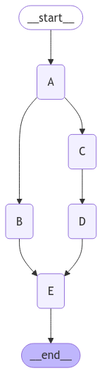

# Branches for parallel node execution


<!-- WARNING: THIS FILE WAS AUTOGENERATED! DO NOT EDIT! -->

In this Notebook we study on a minimal example an unexpected behavior
when branches of a LangGraph run in parallel.

``` python
from langgraph.graph import StateGraph, END, START
from langgraph.checkpoint.memory import MemorySaver
from typing import Annotated, TypedDict
from operator import add
from IPython.display import Image, display
```

``` python
class OverallState(TypedDict):
    a: Annotated[list[str], add]
    b: Annotated[list[str], add]
    c: Annotated[list[str], add]
    d: Annotated[list[str], add]
    e: Annotated[list[str], add]
```

``` python
workflow = StateGraph(OverallState)

# add nodes
workflow.add_node("A", lambda _: {"a": ["I am A"]})
workflow.add_node("B", lambda _: {"b": ["I am B"]})
workflow.add_node("C", lambda _: {"c": ["I am C"]})
workflow.add_node("D", lambda _: {"d": ["I am D"]})
workflow.add_node("E", lambda state: {"e": [*state["c"], *state["d"]]})

# add edges
workflow.add_edge(START, "A")
workflow.add_edge("A", "B")
workflow.add_edge("A", "C")
workflow.add_edge("C", "D")
workflow.add_edge("D", "E")
workflow.add_edge("B", "E")
workflow.add_edge("E", END)

# compile the graph
memory = MemorySaver()
graph = workflow.compile(checkpointer=memory)
```

``` python
display(Image(graph.get_graph().draw_mermaid_png()))
```



``` python
config = {"configurable": {"thread_id": "foo"}}
graph.invoke(input={"a": []}, config=config)
```

    {'a': ['I am A'],
     'b': ['I am B'],
     'c': ['I am C'],
     'd': ['I am D'],
     'e': ['I am C', 'I am C', 'I am D']}

Expected outcome would have been:

    {'a': ['I am A'],
     'b': ['I am B'],
     'c': ['I am C'],
     'd': ['I am D'],
     'e': ['I am C', 'I am D']}

``` python
state = graph.get_state_history(config)
```

``` python
list(state)
```

    [StateSnapshot(values={'a': ['I am A'], 'b': ['I am B'], 'c': ['I am C'], 'd': ['I am D'], 'e': ['I am C', 'I am C', 'I am D']}, next=(), config={'configurable': {'thread_id': 'foo', 'checkpoint_ns': '', 'checkpoint_id': '1efcaec7-f07c-6b50-8004-b2d7949e4800'}}, metadata={'source': 'loop', 'writes': {'E': {'e': ['I am C', 'I am D']}}, 'thread_id': 'foo', 'step': 4, 'parents': {}}, created_at='2025-01-04T22:37:36.408448+00:00', parent_config={'configurable': {'thread_id': 'foo', 'checkpoint_ns': '', 'checkpoint_id': '1efcaec7-f07b-684a-8003-c8fab6f375d3'}}, tasks=()),
     StateSnapshot(values={'a': ['I am A'], 'b': ['I am B'], 'c': ['I am C'], 'd': ['I am D'], 'e': ['I am C']}, next=('E',), config={'configurable': {'thread_id': 'foo', 'checkpoint_ns': '', 'checkpoint_id': '1efcaec7-f07b-684a-8003-c8fab6f375d3'}}, metadata={'source': 'loop', 'writes': {'D': {'d': ['I am D']}, 'E': {'e': ['I am C']}}, 'thread_id': 'foo', 'step': 3, 'parents': {}}, created_at='2025-01-04T22:37:36.407960+00:00', parent_config={'configurable': {'thread_id': 'foo', 'checkpoint_ns': '', 'checkpoint_id': '1efcaec7-f078-6ce4-8002-911717e861db'}}, tasks=(PregelTask(id='32e384b7-bf66-be75-8d22-be5e804213f9', name='E', path=('__pregel_pull', 'E'), error=None, interrupts=(), state=None, result={'e': ['I am C', 'I am D']}),)),
     StateSnapshot(values={'a': ['I am A'], 'b': ['I am B'], 'c': ['I am C'], 'd': [], 'e': []}, next=('D', 'E'), config={'configurable': {'thread_id': 'foo', 'checkpoint_ns': '', 'checkpoint_id': '1efcaec7-f078-6ce4-8002-911717e861db'}}, metadata={'source': 'loop', 'writes': {'B': {'b': ['I am B']}, 'C': {'c': ['I am C']}}, 'thread_id': 'foo', 'step': 2, 'parents': {}}, created_at='2025-01-04T22:37:36.406850+00:00', parent_config={'configurable': {'thread_id': 'foo', 'checkpoint_ns': '', 'checkpoint_id': '1efcaec7-f076-6174-8001-95ece4b9028a'}}, tasks=(PregelTask(id='008152d8-9765-03b4-59f7-c8249cfa5ece', name='D', path=('__pregel_pull', 'D'), error=None, interrupts=(), state=None, result={'d': ['I am D']}), PregelTask(id='cacb1ecd-6cd8-91ce-de01-3cebf846df60', name='E', path=('__pregel_pull', 'E'), error=None, interrupts=(), state=None, result={'e': ['I am C']}))),
     StateSnapshot(values={'a': ['I am A'], 'b': [], 'c': [], 'd': [], 'e': []}, next=('B', 'C'), config={'configurable': {'thread_id': 'foo', 'checkpoint_ns': '', 'checkpoint_id': '1efcaec7-f076-6174-8001-95ece4b9028a'}}, metadata={'source': 'loop', 'writes': {'A': {'a': ['I am A']}}, 'thread_id': 'foo', 'step': 1, 'parents': {}}, created_at='2025-01-04T22:37:36.405739+00:00', parent_config={'configurable': {'thread_id': 'foo', 'checkpoint_ns': '', 'checkpoint_id': '1efcaec7-f074-6388-8000-bafeda914f83'}}, tasks=(PregelTask(id='da6eba48-60e3-bd12-09a1-02880554d4f4', name='B', path=('__pregel_pull', 'B'), error=None, interrupts=(), state=None, result={'b': ['I am B']}), PregelTask(id='0f3c336c-1758-4f66-5414-13156e17b6e6', name='C', path=('__pregel_pull', 'C'), error=None, interrupts=(), state=None, result={'c': ['I am C']}))),
     StateSnapshot(values={'a': [], 'b': [], 'c': [], 'd': [], 'e': []}, next=('A',), config={'configurable': {'thread_id': 'foo', 'checkpoint_ns': '', 'checkpoint_id': '1efcaec7-f074-6388-8000-bafeda914f83'}}, metadata={'source': 'loop', 'writes': None, 'thread_id': 'foo', 'step': 0, 'parents': {}}, created_at='2025-01-04T22:37:36.404971+00:00', parent_config={'configurable': {'thread_id': 'foo', 'checkpoint_ns': '', 'checkpoint_id': '1efcaec7-f069-6faa-bfff-323693b200f3'}}, tasks=(PregelTask(id='aba5d4bf-bfc3-76ea-8476-e075055c8149', name='A', path=('__pregel_pull', 'A'), error=None, interrupts=(), state=None, result={'a': ['I am A']}),)),
     StateSnapshot(values={'a': [], 'b': [], 'c': [], 'd': [], 'e': []}, next=('__start__',), config={'configurable': {'thread_id': 'foo', 'checkpoint_ns': '', 'checkpoint_id': '1efcaec7-f069-6faa-bfff-323693b200f3'}}, metadata={'source': 'input', 'writes': {'__start__': {'a': []}}, 'thread_id': 'foo', 'step': -1, 'parents': {}}, created_at='2025-01-04T22:37:36.400778+00:00', parent_config=None, tasks=(PregelTask(id='807bf6a2-e36d-9510-8199-9ff280d7ba3f', name='__start__', path=('__pregel_pull', '__start__'), error=None, interrupts=(), state=None, result={'a': []}),))]

Execution of step ‘E’ is not delayed until the parallel execution of
nodes ‘B’, ‘C’, and ‘D’ is fully completed. Instead, ‘E’ is triggered
after node ‘B’ finishes and then again after node ‘D’ is executed.
